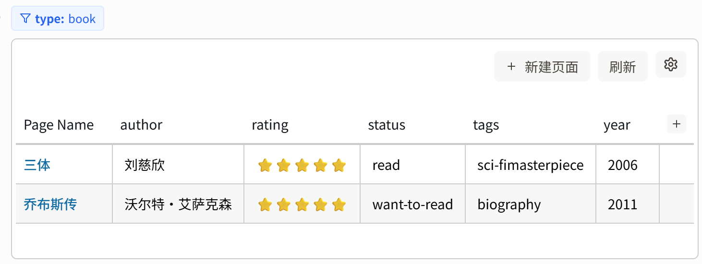
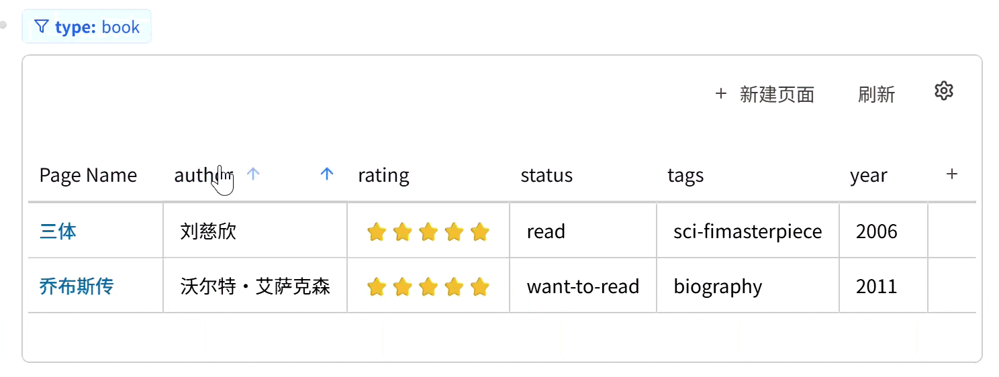
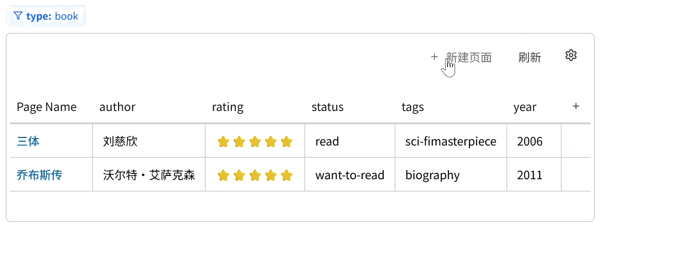

# Logseq Table View Plugin (表格视图插件)

A table view plugin designed for Logseq, allowing users to view and edit query results in a spreadsheet-like format. It provides an intuitive property editing interface, supports sorting, column dragging, hiding columns, and more, making it easier to manage large amounts of structured data.

这是一个为 Logseq 设计的表格视图插件，允许用户以电子表格的形式查看和编辑查询结果。它提供了直观的属性编辑界面，支持排序、列拖拽、隐藏列等功能，让管理大量结构化数据变得更加轻松。

## ✨ Features (主要功能)

- **📊 Table Visualization**: Present Logseq query results neatly in a table format.
  - **表格化展示**: 将 Logseq 的查询结果以表格形式整洁地呈现。
- **✏️ Direct Editing**: Double-click cells to directly modify page or block properties, with changes synchronized to the database.
  - **直接编辑**: 双击单元格即可直接修改页面或块的属性，修改结果实时同步到数据库。
- **🔄 Two-way Sync**: Modifications in the table are immediately reflected in Logseq pages/blocks.
  - **双向同步**: 在表格中的修改会立即反映在 Logseq 页面/块中。
- **🔃 Sorting**: Click column headers to sort any column in ascending or descending order.
  - **排序支持**: 点击表头即可对任意列进行升序或降序排序（支持数字和文本）。
- **✋ Drag & Drop**: Hold and drag column headers to adjust column order.
  - **拖拽排版**: 按住表头即可拖拽调整列的顺序，定制你的视图。
- **👁️ Column Management**: Hide specific property columns or add new ones.
  - **列管理**: 支持隐藏不需要的属性列，或添加新的属性列。
- **➕ Quick Creation**: Create new pages directly in the table view.
  - **快速创建**: 支持在表格视图中直接创建新页面，并自动填充当前查询的默认属性。

## 📖 How to Use (使用指南)

### 1. Insert Table (插入表格)

In any block in Logseq, use the renderer syntax:
在 Logseq 的任意块中，使用以下命令格式插入表格：

```
{{renderer :table-view, query-statement}}
```

Or use the slash command `/Table View` to insert quickly.
或者使用斜杠命令 `/Table View` 快速插入。

#### Supported Query Syntax (查询语句支持)

1.  **Simple Syntax (Recommended / 简易语法)**:

    - `type::book` (Query all pages/blocks with property `type` as `book` / 查询所有属性 `type` 为 `book` 的页面/块)
    - `status::doing`

2.  **Advanced Syntax (高级语法 / Datalog)**:
    - `(page-property :type "book")`

### 2. Operations (操作说明)

- **Edit Properties**: Click any cell, enter new content, and press Enter to save.
  - **编辑属性**: 单击任意属性单元格，输入新内容并回车即可保存。
- **Rename Page**: Click the "Page Name" column to edit and rename the page.
  - **重命名页面**: 第一列“Page Name”支持点击编辑，回车后将执行重命名操作。
- **Sort**: Click header text to toggle Ascending/Descending order.
  - **排序**: 点击表头文字，切换 升序/降序/默认 状态。
- **Reorder Columns**: Drag column headers left or right.
  - **调整列宽/顺序**: 鼠标按住表头左右拖动可调整列顺序。
- **Show/Hide Columns**: Click the settings icon ⚙️ to toggle column visibility.
  - **显隐列**: 点击右上角的设置图标 ⚙️，勾选或取消勾选以显示或隐藏列。
- **New Column**: Click the `+` sign on the far right of the header.
  - **新建列**: 点击表头最右侧的 `+` 号，输入新的属性名称即可添加一列。

## 📷 Screenshots (截图演示)

### 1. Main Interface (插件主界面)


_(Main interface / 插件主界面)_

### 2. Sorting & Columns (排序与列管理)


_(Sorting and hiding columns / 排序与显隐列)_

### 3. Editing & Creating (编辑与新建)


_(Editing cells and creating pages / 编辑单元格与新建页面)_

## 🛠️ Installation & Development (安装与开发)

### Installation (安装)

1. Download the latest Release zip package.
   - 下载最新发布的 Release zip 包。
2. Enable "Developer Mode" in Logseq Plugin Center.
   - 在 Logseq 插件中心开启 "Developer Mode" (开发者模式)。
3. Click "Load unpacked plugin" and select the unzipped folder.
   - 点击 "Load unpacked plugin"，选择解压后的文件夹。

### Local Development (本地开发)

If you need to build or modify the code yourself:
如果您需要自行构建或修改代码：

```bash
# Install dependencies / 安装依赖
npm install

# Start dev server / 启动开发服务器
npm run dev

# Build for production / 构建生产版本
npm run build
```

After building, point Logseq to the `dist` directory (or root, depending on config).
构建完成后，将 Logseq 指向 `dist` 目录 (或者根目录，视 `package.json` 配置而定)。

## 📝 Contribution (贡献)

Issues and Pull Requests are welcome!
欢迎提交 Issue 或 Pull Request！

## 📄 License

MIT
